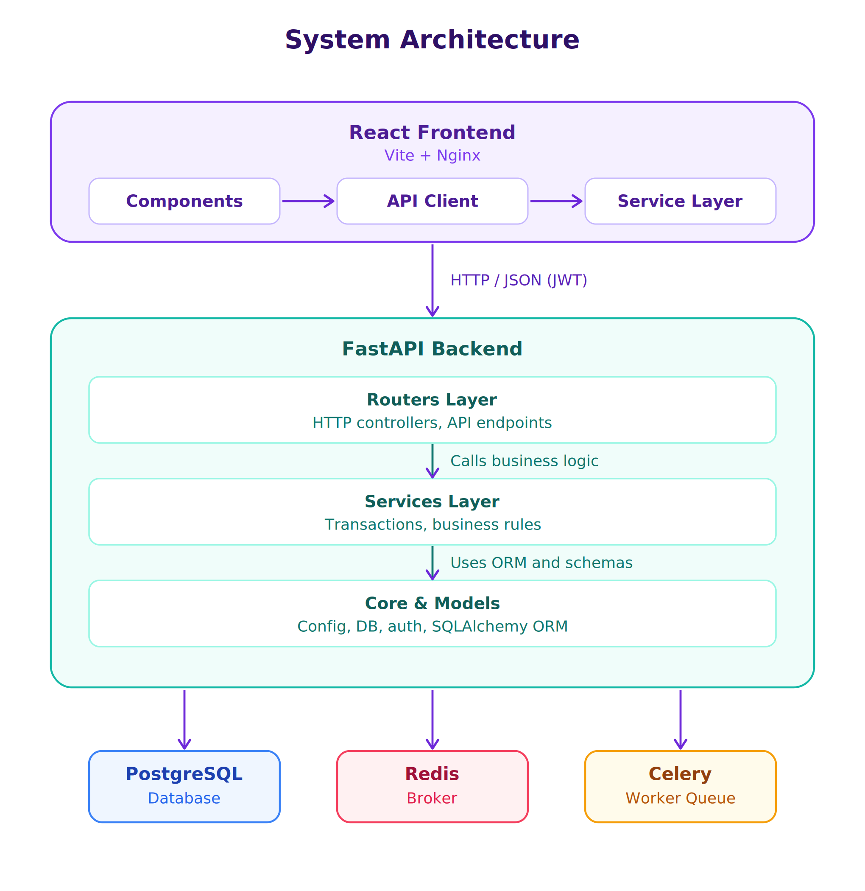

# Library Management System

A production-ready, full-stack **Library Management System** built with **FastAPI**, **PostgreSQL**, **Celery**, **Redis**, and a responsive **React (Vite)** frontend. The system follows a clean **Layered Architecture**, provides **Role-Based Access Control (RBAC)**, dispatches **asynchronous background jobs**, and is fully containerized with **Docker** and **Docker Compose**.

---

## Key Features

### Authentication & Security
- **Role-Based Access Control (RBAC)**: Distinct permissions for **Librarians** and **Members**.
- **JWT Authentication**: Secure token issuance using PyJWT with expiration policies.
- **Password Hashing**: Cryptographic password security using `bcrypt`.
- **Dynamic Credentials**: Zero hardcoded secrets; dynamic loading from `.env`.

### Catalog & Loan Management
- **Interactive Book Catalog**: Browse books with real-time title and author search.
- **Book Circulation**: Members can check out available book copies and return them.
- **Inventory Tracking**: Automated decrement/increment of book copy availability upon borrow/return.
- **Personal Dashboard**: Borrowers can view active loans and complete loan history.

### Librarian Administration
- **Add New Books**: Register books into the catalog with ISBN and copy counts.
- **Member Directory**: Inspect registered library members and their access levels.
- **Database Retention Compliance**: Protects records from accidental physical deletion.

### Background Workers & Notifications
- **Asynchronous Task Queue**: Celery distributed workers backed by a Redis message broker.
- **Automated Overdue Scans**: Asynchronously scans active loans to detect overdue books without blocking HTTP cycles.
- **In-App Notifications**: Interactive notification bell badge and popup modals alerting members of pending book returns.
- **Notification Persistence**: Read/unread tracking in the database with user dismissal controls.

### Software Architecture & DevOps
- **Clean Layered Architecture**: Strict separation of concerns (Core, Models, Schemas, Services, Routers).
- **Automated Migrations & Seeding**: Managed via Alembic, with automatic default dataset seeding on startup.
- **Multi-Stage Docker Builds**: Highly optimized container images (Nginx-Alpine static frontend ~20MB and header-stripped Python backend).
- **CI/CD Pipeline**: GitHub Actions running automated `flake8` PEP 8 linter and `pytest` test suites on every push and pull request.

---

## System Architecture

The application adopts a **Layered Clean Architecture** where each layer has a single, well-defined responsibility:



---

## Project Directory Structure

```text
Library-Management-System/
├── .github/
│   └── workflows/
│       └── ci.yml               # GitHub Actions CI workflow (lint & test)
├── backend/
│   ├── app/
│   │   ├── core/                # Core configurations, database engine, & security
│   │   │   ├── config.py        # Environment variables & application settings
│   │   │   ├── database.py      # SQLAlchemy engine, session provider, & auto-seed
│   │   │   └── security.py      # JWT encoding/decoding, bcrypt, & route permission guards
│   │   ├── models/              # SQLAlchemy Database Entities
│   │   │   ├── __init__.py
│   │   │   ├── book.py          # Book table model
│   │   │   ├── member.py        # Member table model
│   │   │   ├── loan.py          # Loan table model
│   │   │   └── notification.py  # Notification table model
│   │   ├── schemas/             # Pydantic validation & serialization models
│   │   │   ├── __init__.py
│   │   │   ├── book.py          # Book schemas (BookCreate, BookSchema)
│   │   │   ├── member.py        # Member schemas (MemberCreate, MemberSchema, Token)
│   │   │   ├── loan.py          # Loan schemas (LoanCreate, LoanDetailSchema)
│   │   │   └── notification.py  # NotificationSchema
│   │   ├── routers/             # FastAPI APIRouter endpoints (HTTP controllers)
│   │   │   ├── __init__.py
│   │   │   ├── auth.py          # /login and /signup
│   │   │   ├── books.py         # /books and /books/search
│   │   │   ├── loans.py         # /books/loan, /loans, and /loans/{id}/return
│   │   │   ├── members.py       # /members
│   │   │   └── notifications.py # /notifications and /loans/overdue/notify
│   │   ├── services/            # Pure business logic and database operations
│   │   │   ├── __init__.py
│   │   │   ├── auth.py          # Authentication and user registration logic
│   │   │   ├── books.py         # Catalog querying and book insertion
│   │   │   ├── loans.py         # Loan transaction checks and stock mutations
│   │   │   ├── members.py       # Member listing logic
│   │   │   └── notifications.py # Notification retrieval and read-state mutation
│   │   ├── celery_app.py        # Celery background tasks & Redis broker config
│   │   ├── cli.py               # Interactive terminal CLI utility
│   │   └── main.py              # FastAPI application bootstrap & lifespan
│   ├── migrations/              # Alembic database migrations
│   │   ├── versions/            # Migration revisions
│   │   └── env.py               # Alembic database runtime environment
│   ├── tests/                   # Backend automated testing suite
│   │   └── testbook.py          # Book validation tests
│   ├── alembic.ini              # Alembic migration configuration
│   ├── Dockerfile               # Multi-stage optimized backend container
│   ├── main.py                  # CLI runner entrypoint
│   └── requirements.txt         # Python dependencies
├── frontend/
│   ├── src/
│   │   ├── components/          # Modular React components
│   │   │   ├── Auth.jsx         # Sign In and Sign Up modal forms
│   │   │   ├── Catalog.jsx      # Book catalog with live search & borrow action
│   │   │   ├── Librarian.jsx    # Librarian dashboard (Add book, Members, Task triggers)
│   │   │   ├── Member.jsx       # Member loan history & return action
│   │   │   └── NotificationsModal.jsx # Overdue warnings popup modal
│   │   ├── services/            # Frontend API client & service abstraction layer
│   │   │   ├── apiClient.js     # Centralized fetch wrapper (token injection & JSON parsing)
│   │   │   ├── authService.js   # Auth requests
│   │   │   ├── bookService.js   # Book catalog requests
│   │   │   ├── loanService.js   # Loan circulation requests
│   │   │   └── notificationService.js # Notification requests
│   │   ├── App.jsx              # Main UI component & state orchestration
│   │   ├── config.js            # Frontend configuration (API base URL)
│   │   ├── index.css            # Custom CSS design system (Dark glassmorphism)
│   │   └── main.jsx             # React DOM root entrypoint
│   ├── Dockerfile               # Multi-stage Nginx Alpine container (~20MB)
│   ├── package.json             # Frontend dependencies & build scripts
│   └── vite.config.js           # Vite development server configuration
├── .env.example                 # Template for required environment variables
├── docker-compose.yml           # Full-stack container orchestration
├── architecture.png             # Architecture diagram image
└── README.md                    # Project documentation
```

---

## Technology Stack

| Layer | Technologies |
|---|---|
| **Backend API** | Python 3.10+, FastAPI, Uvicorn, Pydantic v2 |
| **Database & ORM** | PostgreSQL 16, SQLAlchemy 2.0, Alembic |
| **Authentication** | PyJWT (JSON Web Tokens), Passlib (Bcrypt) |
| **Background Jobs** | Celery 5.x, Redis 7 |
| **Frontend** | React 18, Vite, Vanilla CSS3 (Custom Glassmorphism Design System) |
| **DevOps & Containers** | Docker, Docker Compose, Nginx Alpine, Multi-stage builds |
| **CI / Quality Assurance** | GitHub Actions, Flake8 (PEP 8), Pytest |

---

## Getting Started

### Prerequisites
Make sure you have installed on your local machine or server:
- [Docker](https://docs.docker.com/get-docker/) and [Docker Compose](https://docs.docker.com/compose/)
*OR (for local development without Docker):*
- **Python 3.10+** (with `pip` or [`uv`](https://github.com/astral-sh/uv))
- **Node.js 18+** and **npm**
- **PostgreSQL 14+** and **Redis 6+**

---

### 1. Environment Configuration

Clone the repository and create your `.env` configuration file from the provided template:

```bash
git clone https://github.com/najmarazzaq761/Library-Management-System.git
cd Library-Management-System

# Copy the example environment file
cp .env.example .env
```

Review `.env` and set your preferred credentials:
```env
POSTGRES_USER=your_postgres_user
POSTGRES_PASSWORD=your_postgres_password
POSTGRES_DB=library_db
CELERY_BROKER_URL=redis://redis:6379/0
CELERY_RESULT_BACKEND=redis://redis:6379/0
JWT_SECRET_KEY=your_secure_random_jwt_secret_key
```

---

### 2. Single-Command Launch (Docker Compose)

The recommended way to start the complete system is using Docker Compose:

```bash
docker compose up --build -d
```

This single command provisions and connects all 5 services:
1. **`library_postgres`**: PostgreSQL database service (`port 5432`).
2. **`library_redis`**: Redis message broker (`port 6379`).
3. **`library_api`**: FastAPI backend service (`port 8000`).
4. **`library_celery`**: Celery asynchronous background worker.
5. **`library_frontend`**: Nginx-served React frontend (`port 5173`).

#### Access Points:
- **Web Application UI**: [http://localhost:5173](http://localhost:5173)
- **Interactive Swagger API Docs**: [http://localhost:8000/docs](http://localhost:8000/docs)
- **ReDoc Documentation**: [http://localhost:8000/redoc](http://localhost:8000/redoc)

#### Useful Docker Commands:
```bash
# View live logs of all services
docker compose logs -f

# View live Celery background worker logs
docker compose logs -f celery_worker

# Stop all services
docker compose down
```

---

### 3. Local Development Setup (Without Docker)

If you prefer to run services natively on your host machine:

#### Step A: Database & Redis
Ensure PostgreSQL and Redis servers are running locally on their default ports (`5432` and `6379`).

#### Step B: Backend Setup
```bash
cd backend

# Create and activate a virtual environment
python -m venv .venv
# On Windows:
.venv\Scripts\activate
# On Linux/macOS:
source .venv/bin/activate

# Install dependencies (using uv or pip)
pip install -r requirements.txt

# Run database migrations
alembic upgrade head

# Launch the FastAPI dev server
uvicorn app.main:app --reload --port 8000
```

*(Optional: In a separate terminal, launch the Celery worker)*
```bash
cd backend
celery -A app.celery_app.celery worker --loglevel=info
```

#### Step C: Frontend Setup
```bash
cd frontend

# Install npm dependencies
npm install

# Start the Vite development server
npm run dev
```
Open [http://localhost:5173](http://localhost:5173) in your browser.

---

### 4. Creating an Account
- Navigate to [http://localhost:5173](http://localhost:5173)
- Click **Sign In** -> **Sign Up**
- Choose between **Library Member** or **Librarian** to explore their respective portals and capabilities.

---

## Testing & Code Quality

### Automated Tests
Run unit tests with pytest:
```bash
cd backend
python -m pytest tests/testbook.py
```

### PEP 8 Linting
Verify code styling and standards compliance with flake8:
```bash
cd backend
python -m flake8 .
```

### CI/CD Pipeline
Continuous Integration is configured via `.github/workflows/ci.yml`. On every `push` and `pull_request` to `main` and `staging`:
- Sets up Python 3.10.
- Installs dependencies with `uv`.
- Enforces PEP 8 compliance via `flake8`.
- Executes automated tests via `pytest`.

---

## License

This project is licensed under the terms specified in the [LICENSE](LICENSE) file.